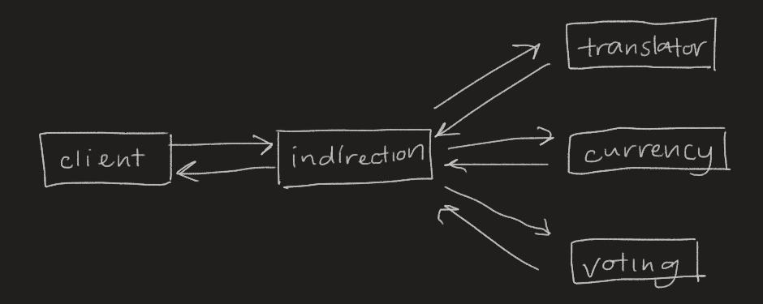

# simple-microservices
Simple client-server program with some three micro services. (From a class assignment)

### How to use
Check user manual for instructions for how to run program.

### How it works

Here's a simple diagram on how communication between the servers works. 

